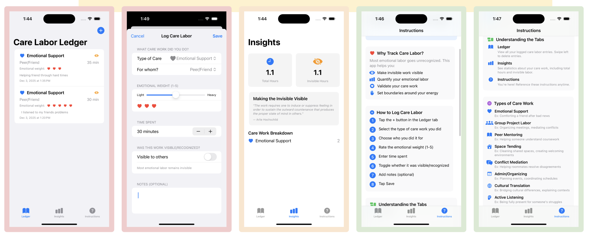
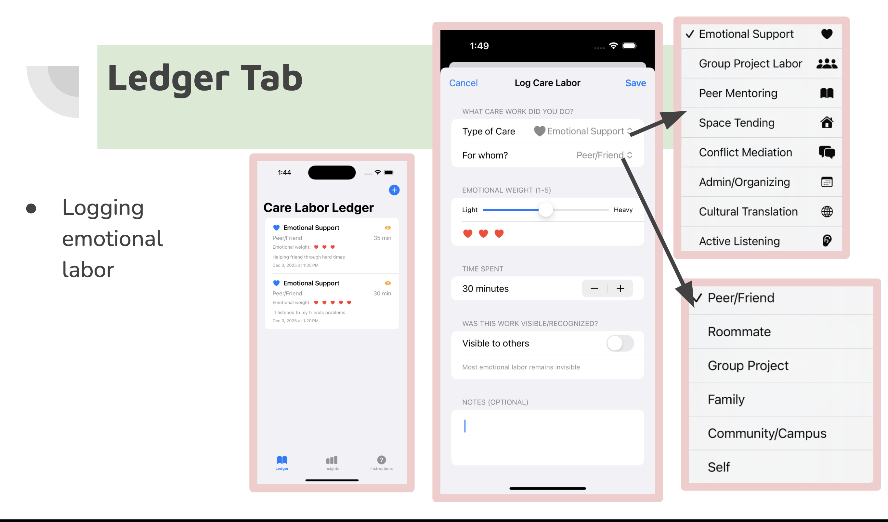
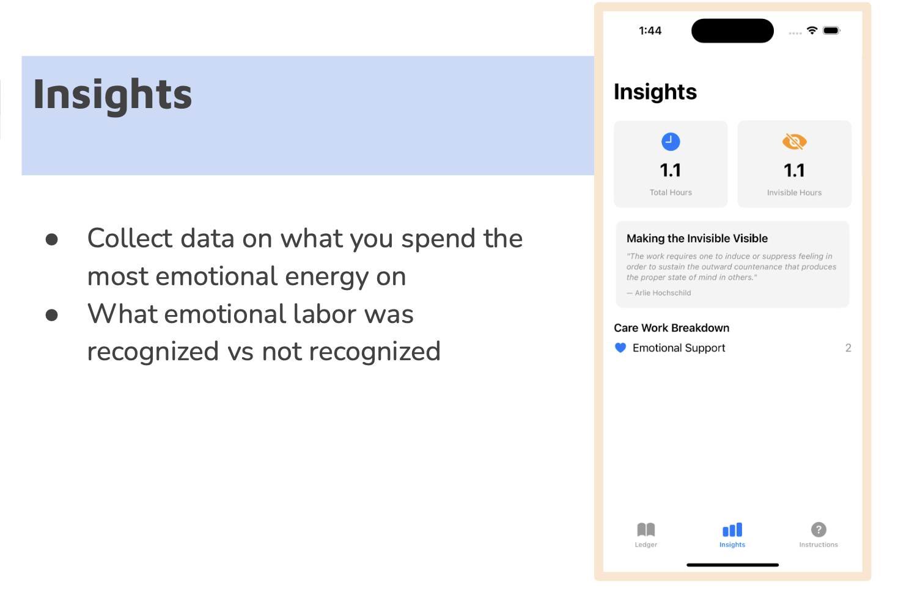
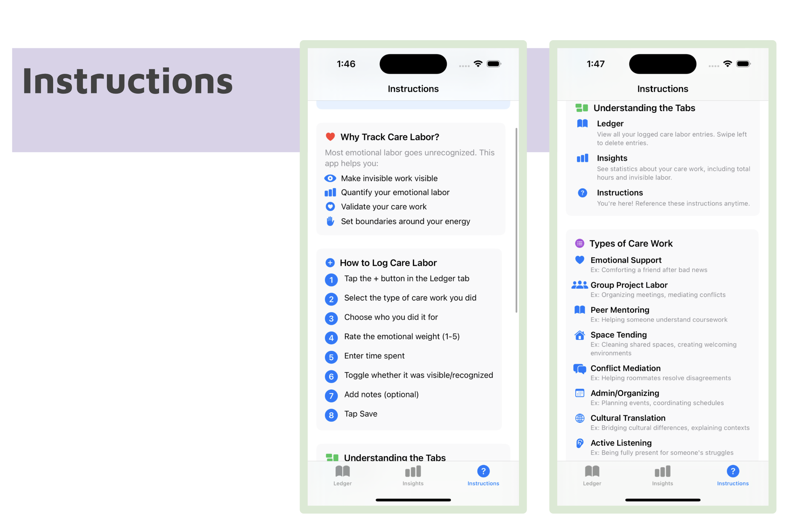

# Care Labor Ledger

A Swift/SwiftUI app for tracking care and emotional labor in a simple personal ledger.

Most emotional labor goes unrecognized. This app helps make that invisible work visible and quantifiable, creating a personal record of the care work students invest in supporting others.

[](https://www.youtube.com/watch?v=pMl69C_k0W8)

## Interface



| Ledger | Insights | Instructions |
|--------|----------|--------------|
|  |  |  |

## Features

### Ledger Tab
Log care labor entries with structured fields:
- **Type of Care** -- Emotional Support, Group Project Labor, Peer Mentoring, Space Tending, Conflict Mediation, Admin/Organizing, Cultural Translation, Active Listening
- **Recipient** -- Peer/Friend, Roommate, Group Project, Family, Community/Campus, Self
- **Emotional Weight** -- 1 to 5 scale (light to heavy), displayed as hearts
- **Time Spent** -- duration in minutes
- **Visibility Toggle** -- mark whether the work was recognized by others
- **Notes** -- optional freeform context

Swipe left on any entry to delete it.

### Insights Tab
Aggregated statistics on your logged care work:
- Total hours spent
- Invisible hours (labor that went unrecognized)
- Breakdown by care work type

Includes a quote from Arlie Hochschild on emotional labor and the work of sustaining outward composure for the benefit of others.

### Instructions Tab
In-app onboarding that explains why tracking care labor matters, walks through how to log an entry step by step, describes each tab, and defines the eight types of care work with examples.

## Motivation

Care labor -- comforting a friend, mediating a conflict, organizing shared spaces -- takes real time and emotional energy but rarely gets acknowledged. This app draws on Arlie Hochschild's concept of emotional labor to give users a way to:

- Make invisible work visible
- Quantify their emotional energy
- Validate their care work
- Set boundaries around their energy

## Running the App Locally

1. **Clone the repository**
   ```bash
   git clone https://github.com/<YOUR-USERNAME>/<YOUR-REPO>.git
   ```

2. **Open the project in Xcode**
   Go to **File > Open...** and select the project folder (the folder containing the `.swift` files and `Assets.xcassets`).

3. **Select a simulator**
   Use the device selector in the toolbar (e.g., **iPhone 15 Pro**).

4. **Run the app**
   Press **⌘R** to build and launch.

## Built With

- Swift
- SwiftUI
- Xcode
